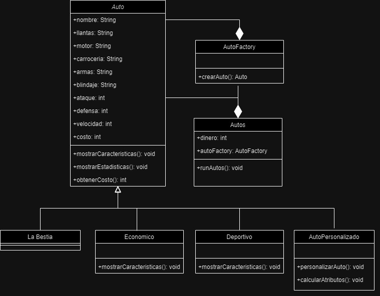

# Practica 03 del curso de Modelado y Programación. *Patrones de diseño*.
### Geronimo Soto Leslie   320032848
### Lozano Estrada Yael    319007095

## ELECCION: PATRON FACTORY
Elegimos este patron de diseño ya que el uso del patrón Factory promueve la programación basada en interfaces y abstracciones en lugar de implementaciones concretas, lo que conduce a un código más mantenible, y como se puede ver en el codigo, es lo que utilizamos para que sea mas flexible.

## ACTIVIDAD 1
Menciona los principios de diseño esenciales de los patrones Factory, Abstract Factory y Builder. Menciona una desventaja de cada patron. 

### PATRONES DE DISEÑO FACTORY 
Los patrones Factory son un conjunto de patrones de diseño en programación orientada a objetos que se utilizan para crear objetos sin especificar la clase exacta del objeto que se creará. Los principios de diseño esenciales asociados con los patrones Factory incluyen:

1. **Abstracción de la creación**: Los patrones Factory se centran en ocultar los detalles de la creación de objetos y proporcionar una interfaz común para crear objetos de diferentes tipos o clases. Esto promueve la abstracción y la encapsulación.

2. **Separación de responsabilidades**: Los patrones Factory ayudan a dividir la responsabilidad de la creación de objetos de la lógica del cliente. Esto significa que el cliente no necesita conocer los detalles de cómo se crea un objeto, lo que facilita el mantenimiento y la extensión del código.

3. **Flexibilidad y extensibilidad**: Los patrones Factory permiten agregar fácilmente nuevos tipos de objetos sin modificar el código existente. Esto es especialmente útil en sistemas donde la jerarquía de clases puede cambiar con el tiempo.

4. **Reutilización de código**: Al centralizar la creación de objetos en un patrón Factory, se promueve la reutilización de código. En lugar de duplicar código de creación en varios lugares, se puede utilizar el Factory para crear objetos de manera consistente.

5. **Polimorfismo**: Los patrones Factory aprovechan el polimorfismo, lo que significa que los objetos creados pueden ser tratados de manera uniforme a través de interfaces comunes, independientemente de la clase concreta a la que pertenecen.

6. **Configuración y parametrización**: Los patrones Factory a menudo admiten la configuración y la parametrización de objetos durante su creación. Esto permite personalizar objetos según las necesidades del cliente sin modificar el código del cliente.

Los patrones Factory se dividen generalmente en tres categorías principales: Factory Method, Abstract Factory y Simple Factory. Cada uno de estos patrones tiene sus propias implementaciones y casos de uso específicos, pero todos comparten estos principios de diseño esenciales relacionados con la creación de objetos de manera más flexible y abstraída.

DESVENTAJA: Una desventaja potencial de los patrones Factory es que pueden aumentar la complejidad de un código si se utilizan en exceso o de manera inapropiada. 

### PATRONES DE DISEÑO ABSTRACT FACTORY
Los patrones Abstract Factory son un conjunto de patrones de diseño que proporcionan una interfaz para crear familias de objetos relacionados o dependientes sin especificar sus clases concretas. Los principios de diseño esenciales asociados con los patrones Abstract Factory incluyen:

1. **Abstracción de la creación de objetos**: Los patrones Abstract Factory se centran en abstraer la creación de objetos y proporcionar una interfaz común para crear familias de objetos relacionados. Esto ayuda a ocultar los detalles de implementación y promueve la flexibilidad en el diseño.

2. **Separación de responsabilidades**: Los patrones Abstract Factory separan la creación de objetos de su uso. Esto significa que el cliente que utiliza los objetos no necesita conocer los detalles de cómo se crean o ensamblan. Esta separación de responsabilidades facilita el mantenimiento y la escalabilidad del código.

3. **Soporte para variaciones en familias de objetos**: Los patrones Abstract Factory permiten definir múltiples implementaciones de fábricas concretas que crean familias de objetos diferentes. Esto es útil cuando se necesita soportar varias variantes de un sistema sin cambiar el código cliente.

4. **Polimorfismo**: Al utilizar patrones Abstract Factory, los objetos creados pueden ser tratados de manera uniforme a través de interfaces comunes, independientemente de la familia concreta de objetos a la que pertenecen. Esto fomenta el polimorfismo y la reutilización de código.

5. **Coherencia en el diseño**: Los patrones Abstract Factory promueven la coherencia en el diseño al garantizar que los objetos relacionados se creen de manera consistente dentro de una familia de objetos. Esto reduce la posibilidad de errores de diseño y facilita la comprensión del sistema.

6. **Facilita la expansión**: Los patrones Abstract Factory hacen que sea más fácil agregar nuevas familias de objetos o variantes al sistema sin afectar el código existente. Esto es especialmente útil en sistemas donde se espera que las familias de objetos evolucionen con el tiempo.

7. **Flexibilidad y adaptabilidad**: Los patrones Abstract Factory permiten que las familias de objetos se ajusten o cambien dinámicamente en tiempo de ejecución, lo que los hace adecuados para situaciones en las que se necesita adaptabilidad.

En resumen, los patrones Abstract Factory se centran en proporcionar una interfaz abstracta para crear familias de objetos relacionados, lo que promueve la abstracción, la separación de responsabilidades, el polimorfismo y la flexibilidad en el diseño del software. Estos principios de diseño esenciales son fundamentales para comprender y aplicar este patrón efectivamente.

DESVENTAJA: La desventaja principal de Abstract Factory radica en su potencial para aumentar la complejidad del código, especialmente cuando se aplica innecesariamente en sistemas simples o cuando la flexibilidad proporcionada por el patrón no se aprovecha por completo. Como con cualquier patrón de diseño, es importante evaluar cuidadosamente si Abstract Factory es la 
            elección adecuada para el problema específico que se está abordando y si realmente aporta beneficios significativos en términos de abstracción y flexibilidad.

### PATRONES BUILDER
Los patrones de diseño Builder se utilizan para construir objetos complejos paso a paso. Los principios de diseño esenciales asociados con los patrones Builder incluyen:

1. **Separación de la construcción y la representación**: El patrón Builder separa el proceso de construcción de un objeto complejo de su representación. Esto permite crear diferentes representaciones de un objeto sin cambiar su proceso de construcción.

2. **Construcción paso a paso**: El proceso de construcción se divide en una serie de pasos, lo que facilita la construcción de objetos complejos de manera incremental. Cada paso se encarga de configurar una parte específica del objeto.

3. **Abstracción de la construcción**: El patrón Builder utiliza una interfaz abstracta o una clase base que define los pasos comunes de construcción. Las implementaciones concretas del Builder proporcionan detalles específicos de cómo se construye un objeto.

4. **Director (Director)**: En muchos casos, se utiliza una clase adicional llamada "Director" que coordina la secuencia de pasos de construcción utilizando un objeto Builder. El Director simplifica la creación de objetos complejos para el cliente.

5. **Flexibilidad en la configuración**: Los patrones Builder permiten configurar y personalizar los objetos construidos de diversas maneras. Los clientes pueden elegir qué partes del objeto se crean y cómo se ensamblan.

6. **Reusabilidad**: Los Builders se pueden reutilizar para construir objetos similares con configuraciones ligeramente diferentes. Esto ahorra tiempo y esfuerzo en la creación de objetos complejos.

7. **Encapsulación de la complejidad**: Los patrones Builder encapsulan la complejidad de la construcción de objetos complejos en clases separadas. Esto mejora la claridad del código y facilita su mantenimiento.

8. **Garantía de objeto completo**: Los patrones Builder aseguran que un objeto no esté disponible para su uso hasta que se haya completado su construcción, evitando así estados parciales o incoherentes del objeto.

9. **Aplicabilidad a objetos con muchos parámetros opcionales**: Los patrones Builder son especialmente útiles cuando se construyen objetos con una gran cantidad de parámetros opcionales, ya que facilitan la configuración selectiva de estos parámetros sin tener un constructor con muchos argumentos.

En resumen, los patrones de diseño Builder se centran en la creación de objetos complejos de manera flexible y paso a paso, abstrayendo la construcción y permitiendo que los clientes personalicen la configuración de los objetos. Estos principios de diseño esenciales ayudan a garantizar una construcción eficiente y flexible de objetos complejos en un sistema de software.

DESVENTAJA: Una desventaja potencial del patrón de diseño Builder es que puede aumentar la complejidad del código en comparación con soluciones más simples, especialmente cuando se aplica a objetos que no tienen una estructura compleja o que tienen un número limitado de configuraciones. 

### DIAGRAMA DE CLASES

> [!NOTE]
> El método main se encuentra en la clase Practica3, para correr la práctica ejecutar dicha clase. 
